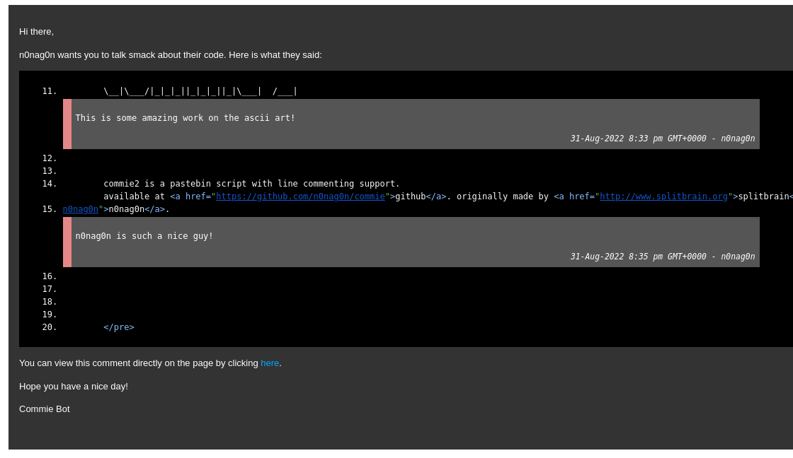

# commie 2.0 ☭

commie 2.0 is a pastebin script with line commenting support. This was originally forked from [splitbrain/commie](https://github.com/splitbrain/commie) and further improved and expanded upon.

## Features
- Pastes are stored as files on the filesystem, encrypted at rest. (no need to configure a database, or plugins, etc.)
- Every line is commentable with the ability for multiple comments from multiple users.
- Comments support Github Markdown!
- Names and emails are cookied for better UX, but easily changable.
- When you make a comment, the user that made the paste can (optionally) receive an email, with syntax highlighted context of the comment. (see screenshots)
- If the paste is markdown, it will auto generate a preview in html (see screenshots)
- Uses [scrivo/highlight.php](https://github.com/scrivo/highlight.php) which is a port of [highlight.js](https://github.com/highlightjs/highlight.js/) with support for many languages.
- Way simple interface and codebase. When I forked it, it took maybe 5 minutes to figure out what was going on.
- Upgraded to modern archtecture to keep only public things in the public directory.
- Compatible with PHP >=7.0

## Install
To install, simply clone this repo and configure your webserver to point to the `public/` directory. You will also need composer and to run `composer install`. Then move to the configuration section.

## Configuration
This is very easy to configure. There is a `.config_sample.php` file with instructions on how to enable emailing, encryption, and other settings. Copy or rename this file to `.config.php` and you're on your way!

## Screenshots
#### Home Page

#### Making a comment

#### Viewing comment

#### Comment via Email

#### Markdown Paste Example

## Contributing
Throw in an issue and if necessary make a pull request. It's a pretty simple codebase!

## Tips
- If you are going to enable email, it would probably be best to put some controls in place to the paste board (such as only certain users can access the URL, HTTP Basic Auth, etc)

## Troubleshooting
Got questions? Here's some common ones...

#### My pastes won't save!
Make sure that your `data/` directory is writable by the webserver user (www-user, apache, nobody, nginx, etc). Something like `chmod g+w data/` should do the trick. If it you need to also change the owner, do so with `chown apache:apache data/` or whatever user you need.

#### Ok I did that, but they still won't save!
Do you have SELinux enabled? You can check with `sestatus` as root and see. If you do have it enabled, you need to make sure that the `data/` dir has the correct context permissions which would likely be something like `semanage fcontext -a -t httpd_sys_rw_content_t "/path/to/commit/data(/.*)?"` and then run `restorecon -Rv /path/to/commie/`

## License
[MIT License](LICENSE.md)